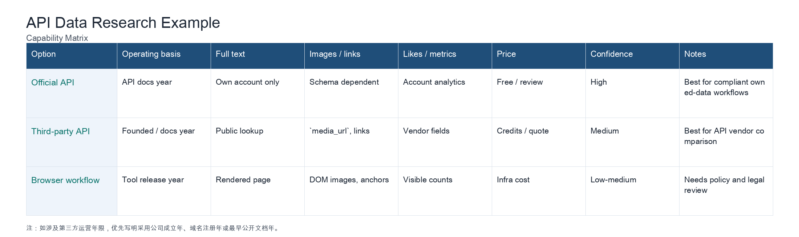

# lgldlk Agent Skills

[中文说明](README.zh-CN.md)

A public collection of reusable agent skills maintained by `lgldlk`.

These skills come from recurring real workflows: researching API data access, aligning mini-program UI with Figma, and extracting public Xiaohongshu notes into local documents. The repository is designed as a personal skill library, while keeping every skill inspectable and installable on its own.

## Skills

| Skill | Purpose | Main output |
|---|---|---|
| [`api-data-research`](skills/api-data-research/SKILL.md) | Compare official and third-party API data access from docs, response examples, pricing pages, and stability signals. | Cited research notes, field-level capability matrices, PNG table exports. |
| [`miniapp-figma-alignment`](skills/miniapp-figma-alignment/SKILL.md) | Implement or fix mini-program, uni-app, or Taro screens so they match Figma dimensions and platform behavior. | Unit conversion decisions, implementation guidance, visual QA checklist. |
| [`xiaohongshu-content-parser`](skills/xiaohongshu-content-parser/SKILL.md) | Parse a public Xiaohongshu share URL, save the post text and metadata, and download media locally. | `report.md`, `normalized.json`, `raw.json`, and local media files. |

## Quick Install

List available skills:

```bash
npx skills add lgldlk/lgldlk-agent-skills --list
```

Install a specific skill:

```bash
npx skills add lgldlk/lgldlk-agent-skills --skill api-data-research -g -a codex -y
npx skills add lgldlk/lgldlk-agent-skills --skill miniapp-figma-alignment -g -a codex -y
npx skills add lgldlk/lgldlk-agent-skills --skill xiaohongshu-content-parser -g -a codex -y
```

Manual install:

```bash
mkdir -p ~/.codex/skills
cp -R skills/api-data-research ~/.codex/skills/
cp -R skills/miniapp-figma-alignment ~/.codex/skills/
cp -R skills/xiaohongshu-content-parser ~/.codex/skills/
```

Restart Codex after installation so the skill metadata is loaded.

## Output Examples

### API Data Research

This skill produces evidence-backed API comparisons instead of relying on vendor claims or SEO visibility. A typical result includes a concise conclusion, a capability matrix, field-level alignment, pricing/access notes, and confidence labels.



Source example: [`examples/api-data-research-example.md`](examples/api-data-research-example.md)

### Miniapp Figma Alignment

This skill helps reason from the actual Figma frame width and the target mini-program unit pipeline.

Minimal result shape:

```text
Figma frame width: 390px
Target design width: 750rpx
Scale: 750 / 390 = 1.9231

Example conversion:
- 16px padding -> 30.77rpx
- 338px card width -> 650.00rpx
- 14px font size -> 26.92rpx

Checks:
- Do not redraw native status bar or capsule.
- Keep safe-area padding for fixed bottom actions.
- Do not mix final rpx values with Taro pxtransform in the same layout region.
```

Source example: [`examples/miniapp-figma-alignment-example.md`](examples/miniapp-figma-alignment-example.md)

### Xiaohongshu Content Parser

This skill turns a public Xiaohongshu share URL into a local note package.

Command:

```bash
node skills/xiaohongshu-content-parser/scripts/parse_xhs.mjs \
  --url "https://www.xiaohongshu.com/explore/..."
```

Result shape:

```text
xiaohongshu-notes/
└── <title>-<YYYY-MM-DD>-<post-id>/
    ├── report.md
    ├── normalized.json
    ├── raw.json
    └── media/
        ├── author-avatar.jpg
        ├── cover.jpg
        └── image-01.jpg
```

Example summary:

```text
Title: Demo note title
Author: Demo Author
Images: 1
Downloads: 3
Report: xiaohongshu-notes/demo-note-2026-06-19-demoid/report.md
```

Sample API response: [`examples/xiaohongshu-content-parser-sample.json`](examples/xiaohongshu-content-parser-sample.json)

## Repository Layout

```text
lgldlk-agent-skills/
├── assets/
│   └── screenshots/
├── docs/
├── examples/
├── scripts/
│   └── validate-skills.sh
├── skills/
│   ├── index.json
│   ├── api-data-research/
│   ├── miniapp-figma-alignment/
│   └── xiaohongshu-content-parser/
└── templates/
```

## Quality Rules

- Each skill lives at `skills/<skill-name>/SKILL.md`.
- `SKILL.md` frontmatter contains only `name` and `description`.
- The frontmatter `name` must match the skill directory.
- Long reference material goes in `references/`.
- Repeatable deterministic logic goes in `scripts/`.
- Public skills must not contain API keys, tokens, cookies, private URLs, or local-only absolute paths.

Validate the repository:

```bash
scripts/validate-skills.sh
```

## License

MIT
